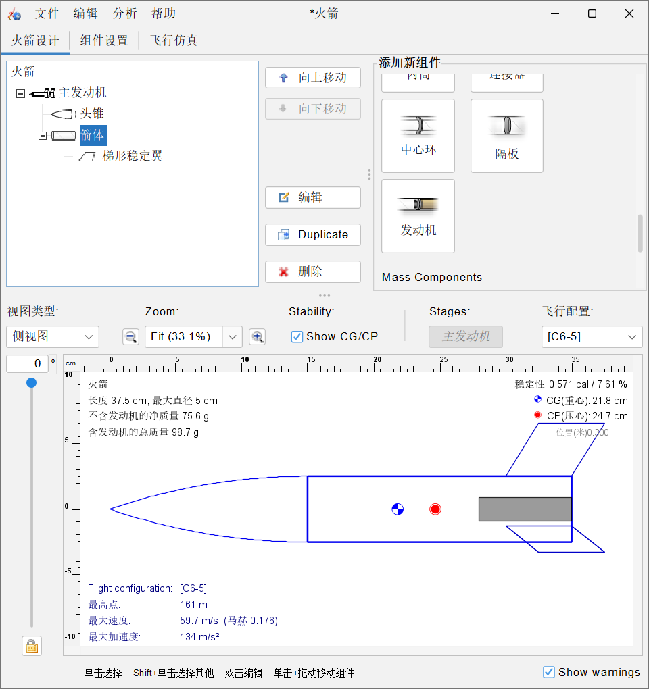
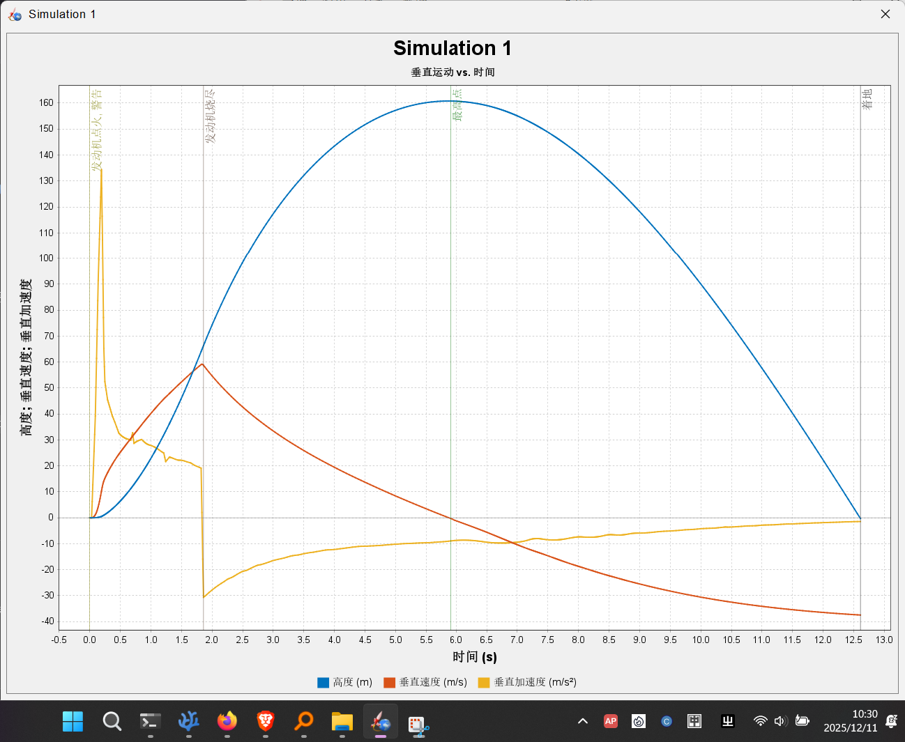

# 十年一梦：我的火箭模拟之旅 (My Ten-Year Rocket Dream: A Simulation Journey)

## 🚀 项目缘起 (The Vision)

这个项目，源于一个在我脑中盘旋了十年的梦想。我着迷于火箭，着迷于它们挣脱引力、飞向深空的磅礴力量。现在，我决定将这个梦想付诸实践，从零开始，一步步构建、模拟、并最终理解火箭飞行的全部奥秘。

这不仅仅是一个代码仓库，这是我未来数年学习和成长的日志，是我兑现十年之约的见证。

*   **项目状态:** `进行中 (In Progress)`
*   **当前里程碑:** `已完成 - M1: 我的第一次稳定飞行`

---

## 📌 里程碑 1: 我的第一次稳定飞行 (Milestone 1: My First Stable Flight)

**日期:** 2025年12月11日

今天，我迈出了最关键的第一步。使用 **OpenRocket** 软件，我成功设计、建造并模拟了我的第一枚模型火箭，代号 **“起源一号” (Genesis-1)**。

虽然它还很简单，但它符合了火箭飞行的基本物理原理，并在模拟中成功达到了预定高度。

### “起源一号” (Genesis-1) 技术档案

*   **软件:** OpenRocket
*   **核心组件:**
    *   头锥 (尖顶拱)
    *   箭体 (直径 5cm)
    *   尾翼 (梯形稳定翼 x3)
*   **动力:** Estes C6-5 发动机
*   **关键成果:** 解决了飞行器设计中最核心的**稳定性问题**，确保了重心(CG)在压力中心(CP)之前。

| 最终设计图 | 飞行数据图 |
| :----------: | :----------: |
|  |  |
| *安装C6-5发动机后，通过调整尾翼高度，稳定性最终达到0.57 cal。* | *模拟最高点(Apogee)达到约162米。* |

### 我学到了什么 (What I Learned)

*   **OpenRocket基础:** 掌握了从零开始添加头锥、箭体、尾翼等核心组件并设定参数的方法。
*   **稳定性黄金法则:** 深刻理解了重心(CG)必须在压力中心(CP)之前，以及如何通过调整组件（如尾翼）来移动CP，实现稳定飞行。
*   **发动机的意义:** 认识到发动机不仅提供推力，其自身质量也是影响火箭重心的关键因素。
*   **仿真与数据解读:** 学会了如何配置并发起一次飞行仿真，并能从高度-速度-加速度曲线图中，解读出发动机燃尽、到达最高点等关键飞行事件。

---

## 🗺️ 未来路线图 (Future Roadmap)

“起源一号”的成功只是一个开始。我的目光，已望向更复杂的挑战。

*   **M2 - 优化与性能极限:**
    *   [ ] 学习如何优化气动外形，减少阻力。
    *   [ ] 尝试不同的发动机，探索“起源一号”构型的性能极限，让它飞得更高、更快。
    *   [ ] 学习降落伞系统的模拟与配置。

*   **M3 - 进阶设计:**
    *   [ ] 设计并模拟一枚多级火箭。
    *   [ ] 学习并联助推器 (Boosters) 的设计。

*   **M4 - 深入物理原理:**
    *   [ ] 学习基础的火箭动力学和轨道力学。
    *   [ ] 尝试用 Python 等编程语言，从零开始编写一个简单的二维火箭弹道模拟器。

*   **最终目标 - 高级控制:**
    *   [ ] **学习并模拟发动机推力矢量控制 (TVC) 和油门节流。**

---

## 📓 开发日志 (Developer's Log)

所有详细的学习笔记、遇到的问题和灵感，都记录在 `log/` 文件夹中。

> “有激动。但也略感失望。因为这次模拟的成果完全是初学者级别……但总之，我们的成果还是有的。” —— Day 1 感悟
